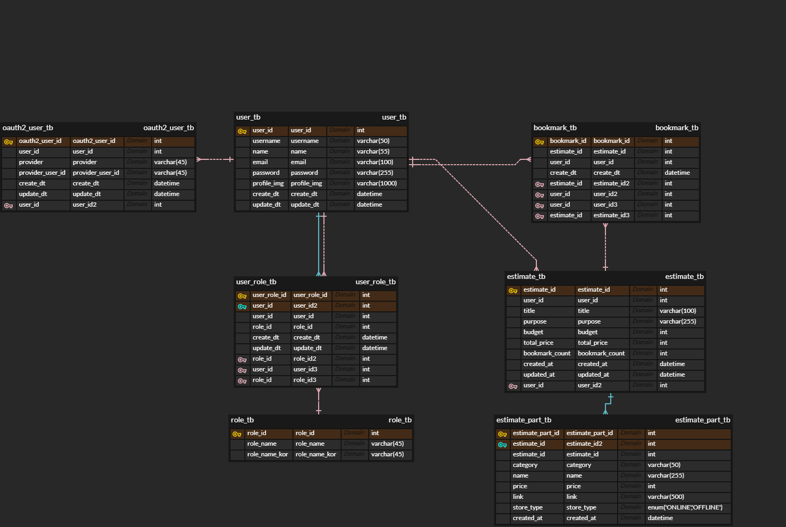

# ⚙️ 5Headers — GPT 기반 맞춤형 컴퓨터 견적 서비스

[]()
[](https://spring.io/projects/spring-boot)
[](https://www.mysql.com/)
[](https://openjdk.org/)
[](https://platform.openai.com/)
[](https://developers.naver.com/docs/serviceapi/search/shopping/shopping.md)
[](https://apis.map.kakao.com/)
[](https://firebase.google.com/)

> GPT를 활용하여 사용자의 요구에 맞는 **맞춤형 컴퓨터 견적**을 생성하고  
> 네이버 쇼핑 및 카카오맵 API를 통해 **온라인/오프라인 구매 경로**를 제공하며,  
> Firebase를 활용한 **프로필 이미지 업로드/저장 기능**까지 지원하는  
> **5Headers 팀의 백엔드 서버**입니다.  
> Spring Boot + MySQL + REST API 기반으로 프론트엔드(Vite + React)와 통신합니다.

---

## 🚀 주요 기능

- 🔐 **회원가입 / 로그인 / JWT 인증**
- 💬 **GPT API 연동** — 사용자의 입력 기반 견적 생성
- 🧠 **OpenAI 응답 JSON 파싱 및 데이터 정제**
- 🛒 **네이버 쇼핑 API** — 부품별 최저가, 온라인 구매 링크 제공
- 🏪 **카카오맵 API** — 내 위치 기반 오프라인 컴퓨터 매장 정보 제공
- 💾 **견적 저장 / 불러오기 / 즐겨찾기**
- 🖼️ **Firebase 연동** — 프로필 이미지 업로드 및 관리
- ⚙️ **Controller / Service / DAO 계층 구조**
- 🌐 **CORS / 예외 처리 / 응답 구조 통일**

---

## 🧰 기술 스택

| 분류 | 사용 기술 |
|------|-----------|
| Language |  |
| Framework |  |
| DB |  |
| Auth |  |
| OAuth2 | Google / Naver / Kakao |
| AI Integration |  |
| API Integration |   |
| Storage |  |
| Build |  |
| Test | 

---

## 📦 주요 의존성 (`pom.xml` 기준)

프로젝트에서 사용한 주요 라이브러리/프레임워크 목록입니다.

- `com.mysql:mysql-connector-j`
- `io.jsonwebtoken:jjwt-api`
- `io.jsonwebtoken:jjwt-impl`
- `io.jsonwebtoken:jjwt-jackson`
- `org.locationtech.jts:jts-core`
- `org.mybatis.spring.boot:mybatis-spring-boot-starter`
- `org.mybatis.spring.boot:mybatis-spring-boot-starter-test`
- `org.projectlombok:lombok`
- `org.springdoc:springdoc-openapi-starter-webmvc-ui`
- `org.springframework.boot:spring-boot-devtools`
- `org.springframework.boot:spring-boot-starter-aop`
- `org.springframework.boot:spring-boot-starter-data-redis`
- `org.springframework.boot:spring-boot-starter-mail`
- `org.springframework.boot:spring-boot-starter-oauth2-client`
- `org.springframework.boot:spring-boot-starter-security`
- `org.springframework.boot:spring-boot-starter-test`
- `org.springframework.boot:spring-boot-starter-thymeleaf`
- `org.springframework.boot:spring-boot-starter-validation`
- `org.springframework.boot:spring-boot-starter-web`
- `org.springframework.security:spring-security-test`
- `org.thymeleaf.extras:thymeleaf-extras-springsecurity6`


 ## 🏗️ 프로젝트 구조
```
src/
 ┣ main/
 ┃ ┣ java/project_5headers/com/
 ┃ ┃ ┣ config/         # Security, CORS, WebFlux 설정
 ┃ ┃ ┣ controller/     # API 엔드포인트 정의
 ┃ ┃ ┣ service/        # 비즈니스 로직
 ┃ ┃ ┣ domain/         # Entity, DTO 클래스
 ┃ ┃ ┣ mapper/         # MyBatis 매퍼 인터페이스
 ┃ ┃ ┗ jwt/            # JWT 토큰 유틸 및 필터
 ┃ ┗ resources/
 ┃   ┣ mapper/         # MyBatis XML 매퍼
 ┃   ┣ templates/      # Thymeleaf (테스트용)
 ┃   ┗ application.properties # 환경 설정 파일
 ┗ test/
     ┗ java/...         # 단위 및 통합 테스트

```
---
## 🛠️ 실행 방법

```bash
# 1. Git clone
git clone https://github.com/5Headers/team_project_backend.git

# 2. DB 설정 (application.yml 또는 application.properties)

# 3. 빌드 및 실행
./mvnw spring-boot:run
```

## 📑 API 명세

### AuthController
| Method | Endpoint | Request Body / Params | Response | 설명 |
|--------|----------|--------------------|----------|-----|
| GET | /auth/principal | - | 현재 로그인한 사용자 정보 | 로그인 사용자 조회 |
| POST | /auth/signup | SignupReqDto | ApiRespDto | 회원가입 |
| POST | /auth/signin | SigninReqDto | ApiRespDto | 로그인 & JWT 발급 |
| GET | /auth/check-username | username | ApiRespDto | 아이디 중복 확인 |
| GET | /auth/check-email | email | ApiRespDto | 이메일 중복 확인 |
| DELETE | /auth/withdraw | - | ApiRespDto | 회원탈퇴 |

### AccountController
| Method | Endpoint | Request Body / Params | Response | 설명 |
|--------|----------|--------------------|----------|-----|
| POST | /account/change/password | ChangePasswordReqDto | ApiRespDto | 비밀번호 변경 |
| POST | /account/reset-password | ResetPasswordReqDto | ApiRespDto | 비밀번호 찾기 |
| POST | /account/change/profileimg | ChangeProfileImgReqDto | ApiRespDto | 프로필 이미지 변경 |
| POST | /account/find-id | name, email | ApiRespDto | 아이디 찾기 |

### EstimateController
| Method | Endpoint | Request Body / Params | Response | 설명 |
|--------|----------|--------------------|----------|-----|
| POST | /estimate/add | Estimate | ApiRespDto | 견적 추가 |
| GET | /estimate/{estimateId} | - | ApiRespDto | 견적 조회 |
| GET | /estimate/user/{userId} | - | ApiRespDto | 사용자 견적 목록 |
| GET | /estimate/list | - | ApiRespDto | 전체 견적 목록 |
| POST | /estimate/update | Estimate | ApiRespDto | 견적 수정 |
| POST | /estimate/remove/{estimateId} | - | ApiRespDto | 견적 삭제 |
| POST | /estimate/gpt | GptEstimateRequest | ApiRespDto | GPT 기반 견적 생성 |

### EstimatePartController
| Method | Endpoint | Request Body / Params | Response | 설명 |
|--------|----------|--------------------|----------|-----|
| POST | /estimate-part/add | EstimatePart | ApiRespDto | 부품 추가 |
| GET | /estimate-part/{estimatePartId} | - | EstimatePart | 부품 조회 |
| GET | /estimate-part/list/{estimateId} | - | List<EstimatePart> | 견적별 부품 목록 |
| POST | /estimate-part/update | EstimatePart | ApiRespDto | 부품 수정 |
| POST | /estimate-part/remove/{estimatePartId} | - | ApiRespDto | 부품 삭제 |
| GET | /estimate-part/list | - | List<EstimatePart> | 전체 부품 목록 |

### BookmarkController
| Method | Endpoint | Request Body / Params | Response | 설명 |
|--------|----------|--------------------|----------|-----|
| POST | /bookmark/add | Bookmark | ApiRespDto | 즐겨찾기 추가 |
| GET | /bookmark/user/{userId} | - | ApiRespDto | 사용자 즐겨찾기 목록 |
| DELETE | /bookmark/remove/{bookmarkId} | - | ApiRespDto | 즐겨찾기 삭제 |
| POST | /bookmark/toggle/{estimateId} | - | ApiRespDto | 즐겨찾기 토글 |

### ChatController
| Method | Endpoint | Request Body / Params | Response | 설명 |
|--------|----------|--------------------|----------|-----|
| POST | /chat/estimate | purpose, cost, title | ApiRespDto<EstimateRespDto> | GPT 기반 견적 생성 |

### KakaoMapController
| Method | Endpoint | Request Body / Params | Response | 설명 |
|--------|----------|--------------------|----------|-----|
| GET | /api/maps/nearby | category, x, y, radius | JSON | 카테고리 기반 주변 검색 |
| GET | /api/maps/computer-stores | x, y, radius | JSON | 내 위치 기준 컴퓨터 매장 검색 |

### MailController
| Method | Endpoint | Request Body / Params | Response | 설명 |
|--------|----------|--------------------|----------|-----|
| POST | /mail/send | SendMailReqDto | ApiRespDto | 이메일 전송 |
| GET | /mail/verify | verifyToken | Thymeleaf | 이메일 인증 |

### OAuth2Controller
| Method | Endpoint | Request Body / Params | Response | 설명 |
|--------|----------|--------------------|----------|-----|
| POST | /oauth2/merge | OAuth2MergeReqDto | ApiRespDto | OAuth2 계정 병합 |
| POST | /oauth2/signup | OAuth2SignupReqDto | ApiRespDto | OAuth2 회원가입 |

---


## ERD 다이어그램



## 팀원 소개 및 역할

| 이름 | 역할 | 담당 업무 |
|------|------|-----------|
|허일녕 &nbsp;&nbsp;&nbsp; | 팀장 / GPT 기능 / 외부 API / 프론트 & 백엔드 | - JWT 기반 로그인/회원가입/인증 전반 담당<br>- JWT Secret 생성 및 Spring Security 연동<br>- AccessToken 발급 및 인증 필터 적용<br>- 토큰 검증 실패 문제(401 Unauthorized, 302 Redirect) 해결<br>- API 설계 및 구현 (회원가입, 로그인, 중복확인, 유저 정보, 찜 API)<br>- 서버 보안/환경 설정 (application.properties, Mail 서버, 외부 API 연동)<br>- DB 설계 및 구현 (MySQL, ERD 설계, 테이블 작성, MyBatis Mapper 연동)<br>- 찜(하트) 기능 UI 구현 및 DB 연동<br>- 버그 수정 (React key warning, 데이터 undefined, 버튼 클릭 반복 메시지 등)<br>- JWT Secret 관련 문제 해결 및 개발 환경 세팅 - GPT 기반 답변 기능 구현 및 JSON 파싱 개선<br>- GPT 답변 중복 저장 문제 수정<br>- GPT 답변과 프론트-백엔드 API 연동 조율<br>- 외부 API 연동 (카카오맵, 네이버 쇼핑 등) 및 오류 디버깅<br>- 프론트엔드 UI/UX 구현 (오프라인 매장, 찜 버튼)<br>- 백엔드 DB 연동 및 오류 수정 (GPT 답변, 찜 기능, 오프라인 매장)<br>- OAuth2 소셜 로그인 연동 문제 수정<br>- 전반적인 API 연동과 디버깅 수행|
|<nobr>이승무</nobr>| 백엔드 (Spring Security + OAuth2) / 프론트엔드 (React) | - 소셜 로그인(OAuth2) 연동 (네이버, 카카오, 구글)<br>- 로그인 성공 시 DB 연동 및 Security 관련 작업<br>- 회원 관리 기능 구현 (로그인, 회원가입, 로그아웃, 계정 찾기, 회원 탈퇴, 비밀번호 변경, 프로필 수정)<br>- 견적 관련 기능 (리스트 UI, 상세내역, 삭제 API 연동)<br>- 라우팅/상태 관리 (React Router, 답변 초기화 기능)<br>- API 연동 코드 작성 (authApi.js 등) |
|<nobr>곽호준</nobr>| GPT 기능 / 외부 API / 프론트 & 백엔드 |- API 설계 및 구현 (회원가입, 로그인, 중복확인, 유저 정보, 찜 API)<br>- 서버 보안/환경 설정 (application.properties, Mail 서버, 외부 API 연동)<br> - GPT 기반 답변 기능 구현 및 JSON 파싱 개선<br>- GPT 답변 중복 저장 문제 수정<br>- GPT 답변과 프론트-백엔드 API 연동 조율<br>- 외부 API 연동 (카카오맵, 네이버 쇼핑 등) 및 오류 디버깅<br>- 프론트엔드 UI/UX 구현 (오프라인 매장, 찜 버튼)<br>- 백엔드 DB 연동 및 오류 수정 (GPT 답변, 찜 기능, 오프라인 매장)<br>- OAuth2 소셜 로그인 연동 문제 수정<br>- 전반적인 API 연동과 디버깅 수행 |
|<nobr>주송현</nobr>| 프론트엔드 / CSS | - 전체 CSS 담당 (main, home, header 등)<br>- UI/UX 스타일링 및 레이아웃 조정 |
|<nobr>오진현</nobr>| 서브 개발 | - 백엔드, 프론트엔드 지원 및 보조 개발 업무 수행 |
---

## 프로젝트에서 마주한 어려움과 해결 과정

이번 프로젝트를 진행하면서 여러 가지 오류와 문제 상황을 직접 경험했습니다. 대표적인 예로는 다음과 같습니다.

### 1. GPT 답변이 DB에 두 번씩 저장되는 문제
- **원인**: GPT API로부터 받은 응답을 처리하는 로직에서, 프론트와 백엔드 간 데이터 전송 과정이 두 번 호출되면서 DB에 중복 저장됨.
- **해결 방법**: API 호출을 한 번만 수행하도록 로직 수정하고, DB 삽입 전에 기존 데이터와 중복되는지 확인하도록 검증 로직 추가.

### 2. 북마크가 DB에 저장되지 않는 문제
- **원인**: 프론트에서 북마크 API 호출 시, 요청 형식이 백엔드에서 기대하는 데이터 구조와 불일치.
- **해결 방법**: 프론트에서 보내는 데이터 구조를 백엔드에서 요구하는 JSON 형식에 맞추어 수정하고, 백엔드에서도 null이나 undefined를 체크하도록 로직 보완.

### 3. OAuth2 소셜 로그인 연동 오류
- **원인**: 네이버, 카카오, 구글 로그인 시 회원 가입 및 로그인 시퀀스가 일부 조건에서 누락되거나 충돌 발생.
- **해결 방법**: OAuth2 로그인 흐름을 회원 가입과 로그인 로직으로 분리하고, DB 검증 및 예외 처리 추가. 또한, 중복 가입 방지와 정상 토큰 발급 검증을 통해 오류 해결.

### 4. GPT 답변 형식 문제 (text → JSON 파싱)
- **원인**: GPT API 응답이 단순 텍스트로 와서, 여러 항목을 DB에 넣거나 프론트로 전달하기 어려움.
- **해결 방법**: API 응답을 JSON 형식으로 변환 후 파싱하도록 로직 수정하여, 각 항목을 DB 및 프론트에서 정확히 처리할 수 있도록 구현.

